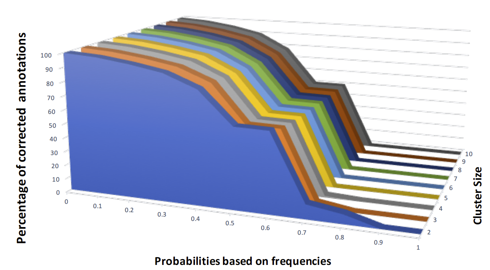

# Sensitivity analysis
Among the detected missannotations, we have defined criteria to  propose the potentially correct one. 
We run sensitivity analysis based on probability of each annotation that we calculate from frequency of 
each annotation within a sequence and within a cluster that the sequence belongs to. We also consider 
the cluster size meaning that if 7 sequence out of 10 cluster provide a specific annotation for a given 
protein we consider this annotations to be a potentially most probable annotations for that protein with 70% confidence.

Details of algorithm is given in the figure below. For each detected missannotation, we look at the sequence and find
the highest probable annotation within a certain threshold p, and if the approach doesn't find that it checks the 
cluster with 95% similarity that this sequence belongs to and finds the one with a certain probability, p,  and a cluster size, c.
The algorithm will not give the same suggestion for changes in parameters. For example, if we change the cluster size, 
no. of proteins in the cluster, it may or may not find correct taxa. 





#### Weight of the databases
* We can extend sensitivity by giving more weight to the reviewed databases
* by giving more weight to the experimental taxonomic assignment with the
  probability of 0.4 we could provide the most probable taxonomic assignment for
  more than 80% of the sequences that were identified as a misclassification.

#### preprocessing

* get the keys that are found to be potentially misannotated

* crate dictionary of sequence membership to clusters

* convert Boa output to one line for each sequence

  ```
  input:
  count[101M][101M][9755] = 1
  count[101M][1MTJ][9755] = 1
  count[101M][1MTK][9755] = 1
  count[101M][1MYM][9755] = 1

  output:
  101M:101M,9755=1;1MTJ,9755=1;1MTK,9755=1;1MYM,9755=1
  ```

  ```
  awk -F: '{print $1, $0}' part-r-00000_converted > part-r-00000_converted_1col

  ```

```
sort part-r-00000_converted_1col > part-r-00000_converted_1col_sorted

# misannotated_keys_sorted are those 3M keys that we found potential violations
join misannotated_keys_sorted  part-r-00000_converted_1col_sorted > part-r-00000_converted_1col_sorted_filtered

# remove the first column which is the key ids; it is redundant
cut -d ' ' -f 2- part-r-00000_converted_1col_sorted_filtered > part-r-00000_converted_1col_sorted_filtered_cut1
```


#### Experiment on Bridges
* location: ```/pylon5/mc5fr5p/hbagheri/00_rawData/verification_NR```
* python script: ``` ```
* run time:    02:07:53
* sub file on Bridges:

```
#!/bin/bash

#BATCH -J verification
#SBATCH -o verify.o%j
#SBATCH -p LM
#SBATCH --mem 128GB
#SBATCH -N 1
#SBATCH -n 28
#SBATCH -t 48:00:00
#SBATCH --mail-user=hbagheri@iastate.edu
#SBATCH --mail-type=begin
#SBATCH --mail-type=end
#SBATCH --error=verifcation.err
#SBATCH --output=verification.out

cd /pylon5/mc5fr5p/hbagheri/00_rawData/verification_NR

python verify_tree.py 95-part-r-00000seq_cluster part-r-00000_converted part-r-00000_converted_1col_sorted_filtered_cut1

```

#### Output
* cluster size, probability, #of corrected Annotations

```
2 0.000000 879732
3 0.000000 879732
4 0.000000 879732
5 0.000000 879732
6 0.000000 879732
7 0.000000 879732
8 0.000000 879732
9 0.000000 879732
10 0.000000 879732
2 0.100000 864086
3 0.100000 864086
4 0.100000 864086
5 0.100000 864086
6 0.100000 864086
7 0.100000 864086
8 0.100000 864086
9 0.100000 864086
10 0.100000 864080
2 0.200000 768539
3 0.200000 768539
4 0.200000 768539
5 0.200000 768197
6 0.200000 766596
7 0.200000 765255
8 0.200000 764411
9 0.200000 763955
10 0.200000 763245
2 0.300000 679219
3 0.300000 679219
4 0.300000 678770
5 0.300000 675981
6 0.300000 673299
7 0.300000 671049
8 0.300000 670254
9 0.300000 669470
10 0.300000 666746
2 0.400000 514223
3 0.400000 511924
4 0.400000 509983
5 0.400000 507564
6 0.400000 505912
7 0.400000 504806
8 0.400000 503818
9 0.400000 502887
10 0.400000 500307
2 0.500000 205863
3 0.500000 201220
4 0.500000 199090
5 0.500000 197523
6 0.500000 196480
7 0.500000 195416
8 0.500000 194428
9 0.500000 193500
10 0.500000 192376
2 0.600000 169187
3 0.600000 166541
4 0.600000 164624
5 0.600000 163385
6 0.600000 162656
7 0.600000 161936
8 0.600000 161138
9 0.600000 160390
10 0.600000 159946
2 0.700000 92105
3 0.700000 90114
4 0.700000 88006
5 0.700000 86718
6 0.700000 86058
7 0.700000 85237
8 0.700000 84303
9 0.700000 83321
10 0.700000 82869
2 0.800000 47209
3 0.800000 45971
4 0.800000 44176
5 0.800000 43502
6 0.800000 43024
7 0.800000 42399
8 0.800000 41395
9 0.800000 40120
10 0.800000 39739
2 0.900000 10354
3 0.900000 9982
4 0.900000 9808
5 0.900000 9629
6 0.900000 9502
7 0.900000 9364
8 0.900000 9268
9 0.900000 9204
10 0.900000 9141
2 1.000000 0
3 1.000000 0
4 1.000000 0
5 1.000000 0
6 1.000000 0
7 1.000000 0
8 1.000000 0
9 1.000000 0
10 1.000000 0


```

#### Excel file
* Link: [Microsoft office]()


