## Exploring full taxonomic cluster output to identify sequences that are mis-classified taxonomically with the genus Glycine but cluster with genus' well outside the Legumes at 95% similarity


Here is the sequence that is taxonomically classified in the genus Glycine
```
clstrOut AAL67577  95  13741561  455  1  455  77  455  10  = 1	clstrOut AAL67577  = AAL67577 CP4EPSPS  Glycine max  ^A AAO17037 CP4EPSPS protein  synthetic construct  ^A AEM75108 CP4 EPSPS glyphosate tolarance protein  synthetic construct  ^A AEP17821 CP4 EPSPS  Expression vector pMON108080  ^A AEP17824 CP4 EPSPS  Expression vector pMON98939  ^A AEP17826 CP4 EPSPS  Expression vector pMON93914  ^A AEP17829 CP4 EPSPS  Expression vector pMON81312  ^A AEP17832 CP4 EPSPS  Expression vector pMON100407  ^A AEP17834 CP4 EPSPS  Expression vector pMON74532  ^A AEP17836 CP4 EPSPS  Expression vector pMON82053  ^A
```

We see from the cluster information that this sequences is 455  AA in length and that the sequence aligns to the cluster's representative sequence from amino acid 77 to 455.  The protein sequence AEP17820 is in the cluster and aligns to the representative sequence between 1 and 76, it is annotated as an expression vector. Many other sequences in the cluster are labeled as synthetic constructs

Ran quickblastp with default parameters on AAL67577 using the web interface for NCBI BLASTP.  This resulted in over a 100 hits with almost maximum length but varied significantly in sequence similarity.  So ran [SMARTBLAST](https://blast.ncbi.nlm.nih.gov/smartblast/smartBlast.cgi) instead.  See this [description as well](ftp://ftp.ncbi.nlm.nih.gov/pub/factsheets/Factsheet_SmartBLAST.pdf)

SMARTBLAST uses a non-redundant set of proteins from 27 taxonomically diverse spieces that have high quality genome assemblies.  Presumably this will reduce the amount of error in taxonomic assignment.

SMARTBLAST on AAL67577 reveals that it is most similar to protein in bacterial species with almost full coverage of the alignment length.  

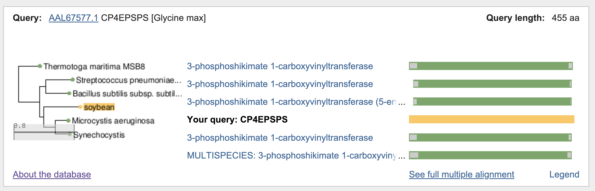

The most similar protein in nr that didnt' have synthetic construct in the defline is 2PQB_A, which is a protein with a functional description of Chain A, 3-phosphoshikimate 1-carboxyvinyltransferase from Agrobacterium.
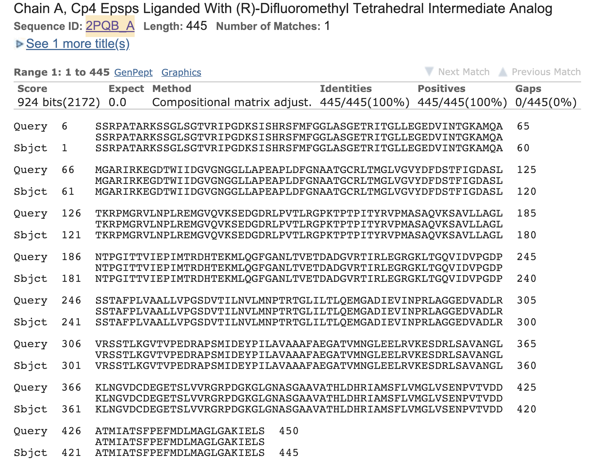


This gene happens to be the glyphosate-insensitive form  5-enolpyruvylshikimate 3-phosphate (EPSP) synthase that is used in the genetically modify crops for [Glyphosate-based herbicides resistance](https://www.pnas.org/content/103/35/13010.short).

This appears to be a case where a synthetic construct was obtained from a genetically modified soybean plant.  It would be easy for a researcher to put both the SOURCE and the ORGANISM attritubes when depositing this sequence as Glycine max rather than the SOURCE as Glycine max and the ORGANISM as synthetic construct and not realize how this can contaminate the database


### Cluster 26559833 at 95% similarity
```
clstrOut EEV24075  95  26559833  389  0  0  0  0  0  = 1	clstrOut EEV24075  = EEV24075 FAD binding domain protein  Enhydrobacter aerosaccus SK60  ^A
clstrOut KHN25027  95  26559833  337  1  337  1  337  99  = 1	clstrOut KHN25027  = KHN25027 Zeaxanthin epoxidase, chloroplastic, partial  Glycine soja  ^A
clstrOut WP_062335070  95  26559833  389  1  389  1  389  98  = 1	clstrOut WP_062335070  = WP_062335070 FAD-dependent urate hydroxylase HpxO  Moraxella osloensis  ^A AME02463 monooxygenase (plasmid)  Moraxella osloensis  ^A OBX52718 monooxygenase  Moraxella osloensis  ^A STZ04790 3-hydroxybenzoate 6-hydroxylase 1  Moraxella osloensis  ^A
clstrOut WP_076776357  95  26559833  389  1  389  1  389  98  = 1	clstrOut WP_076776357  = WP_076776357 MULTISPECIES: FAD-dependent urate hydroxylase HpxO  Proteobacteria  ^A BAV12815 monooxygenase (plasmid)  Moraxella osloensis  ^A ONG37878 monooxygenase  Enhydrobacter sp. H5  ^A ATQ84325 monooxygenase (plasmid)  Moraxella osloensis  ^A ATW86783 monooxygenase (plasmid)  Moraxella osloensis  ^A
clstrOut WP_101965181  95  26559833  389  1  389  1  389  96  = 1	clstrOut WP_101965181  = WP_101965181 FAD-dependent urate hydroxylase HpxO  Moraxella osloensis  ^A PKZ67802 monooxygenase  Moraxella osloensis  ^A
```

Here is the sequence that is taxonomically classified in the genus Glycine
```
clstrOut KHN25027  95  26559833  337  1  337  1  337  99  = 1	clstrOut KHN25027  = KHN25027 Zeaxanthin epoxidase, chloroplastic, partial  Glycine soja  ^A
```

SMARTBLAST of this protein (KHN25027) groups this protein with bacteria.
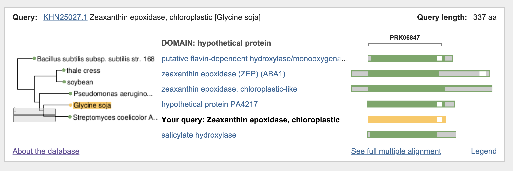

 There is a blast hit to soybean but it is distantly related with a blast E-value of 8e-34 and a percent identity of 34% well below what was in our CD-Hit cluster at 95% similarity over at least 80% length of the shorter sequence.

 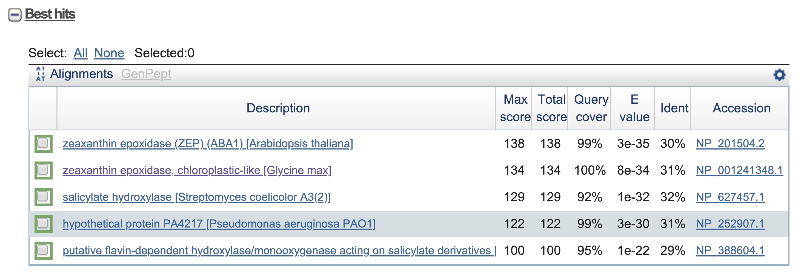

 It's best nr BLAST hit is to EEV24075.1 which is a FAD binding domain protein in Enhydrobacter aerosaccus.

 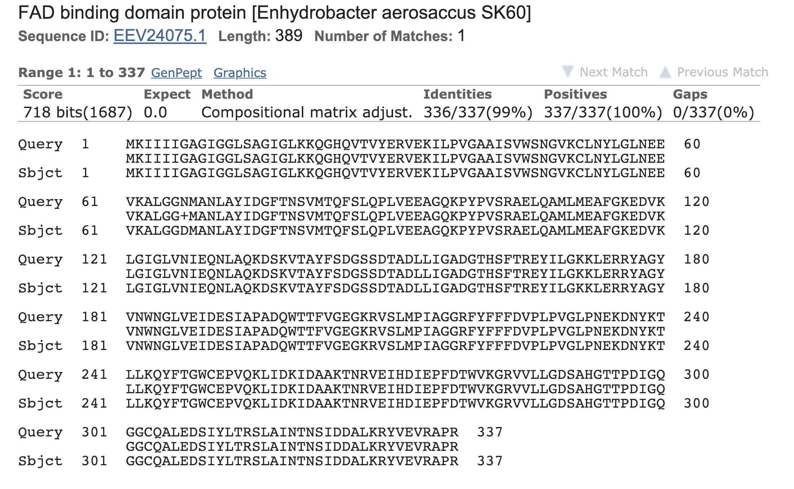

 In this case it would be possible to get a blast hit from a soybean database to the chloroplast genome which originated from bacteria and mis-classify this sequence.  The origin of this contamination in the sample as the tissue-type is listed as root it is plausible that the contaimation came from soil bacteria or a [nodules endophyte](https://www.sciencedirect.com/science/article/pii/S0038071715000127).


### Cluster 37311095 at 95% similarity
```
clstrOut KHN24648  95  37311095  291  1  291  20  291  98  = 1	clstrOut KHN24648  = KHN24648 Branched-chain-amino-acid aminotransferase  Glycine soja  ^A
clstrOut WP_007116868  95  37311095  314  0  0  0  0  0  = 1	clstrOut WP_007116868  = WP_007116868 MULTISPECIES: branched-chain amino acid transaminase  Proteobacteria  ^A EEV22381 branched-chain-amino-acid transaminase  Enhydrobacter aerosaccus SK60  ^A KND22957 branched-chain amino acid aminotransferase  Enhydrobacter aerosaccus  ^A BAV11454 branched-chain amino acid aminotransferase  Moraxella osloensis  ^A OBX62198 branched-chain amino acid aminotransferase  Moraxella osloensis  ^A ONG40080 branched chain amino acid aminotransferase  Enhydrobacter sp. H5  ^A PAL17699 branched chain amino acid aminotransferase  Moraxella osloensis  ^A ATQ85069 branched-chain amino acid transaminase  Moraxella osloensis  ^A
clstrOut WP_062330154  95  37311095  314  1  314  1  314  99  = 1	clstrOut WP_062330154  = WP_062330154 branched-chain amino acid transaminase  Moraxella osloensis  ^A AME00398 branched chain amino acid aminotransferase  Moraxella osloensis  ^A OBX51306 branched-chain amino acid aminotransferase  Moraxella osloensis  ^A ATQ83151 branched-chain amino acid transaminase  Moraxella osloensis  ^A ATW85647 branched-chain amino acid transaminase  Moraxella osloensis  ^A PKZ69190 branched-chain amino acid transaminase  Moraxella osloensis  ^A STY97628 Branched-chain-amino-acid aminotransferase  Moraxella osloensis  ^A
clstrOut WP_065252519  95  37311095  314  1  314  1  314  99  = 1	clstrOut WP_065252519  = WP_065252519 branched-chain amino acid transaminase  Moraxella osloensis  ^A OBX58087 branched-chain amino acid aminotransferase  Moraxella osloensis  ^A
clstrOut WP_100269819  95  37311095  314  1  314  1  314  99  = 1	clstrOut WP_100269819  = WP_100269819 branched-chain amino acid transaminase  Moraxella osloensis  ^A ATR78529 branched chain amino acid aminotransferase  Moraxella osloensis  ^A
```

Here is the sequence that is taxonomically classified in the genus Glycine
```
clstrOut KHN24648  95  37311095  291  1  291  20  291  98  = 1	clstrOut KHN24648  = KHN24648 Branched-chain-amino-acid aminotransferase  Glycine soja  ^A
```

SMARTBLAST of KHN24658 groups with bacterial species.

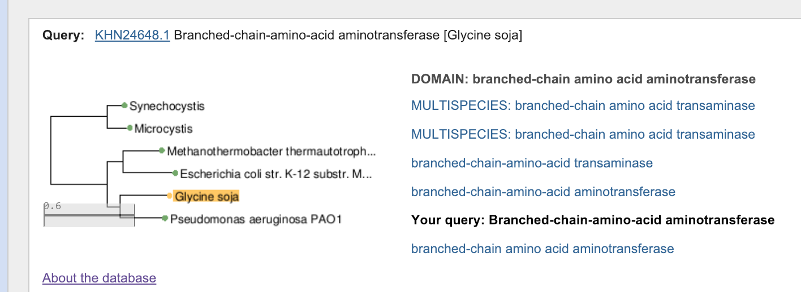

Its best nr BLAST hit is to WP_062330154.1 with 99 % identity over its full length which is a branched-chain amino acid transaminase in the bacteria [Moraxella osloensis]

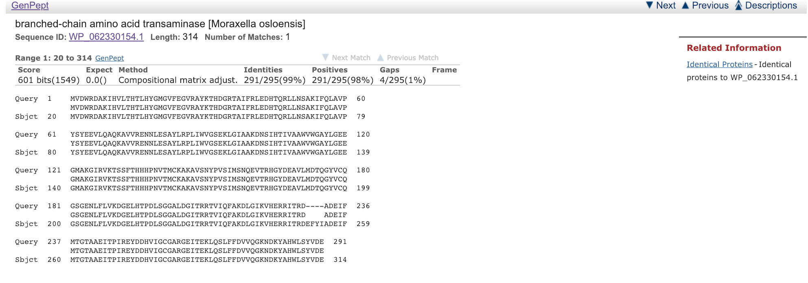

This protein sequence is from the same sample and tissue as KHN25027 and is likely from the same source of contamination.

### Cluster 64827049 at 95% similarity
```
clstrOut KHN42910  95  64827049  103  9  103  70  103  98  = 1	clstrOut KHN42910  = KHN42910 Lactoylglutathione lyase  Glycine soja  ^A
clstrOut PZO92494  95  64827049  58  1  58  1  58  98  = 1	clstrOut PZO92494  = PZO92494 lactoylglutathione lyase, partial  Streptococcus pyogenes  ^A
clstrOut WP_007115888  95  64827049  164  0  0  0  0  0  = 1	clstrOut WP_007115888  = WP_007115888 MULTISPECIES: lactoylglutathione lyase  Proteobacteria  ^A EEV23149 lactoylglutathione lyase  Enhydrobacter aerosaccus SK60  ^A KND19873 lactoylglutathione lyase  Enhydrobacter aerosaccus  ^A BAV12076 lactoylglutathione lyase  Moraxella osloensis  ^A ONG41120 lactoylglutathione lyase  Enhydrobacter sp. H5  ^A ATQ83696 lactoylglutathione lyase  Moraxella osloensis  ^A ATW86188 lactoylglutathione lyase  Moraxella osloensis  ^A
clstrOut WP_060994472  95  64827049  164  1  164  1  164  98  = 1	clstrOut WP_060994472  = WP_060994472 lactoylglutathione lyase  Moraxella osloensis  ^A ATQ85619 lactoylglutathione lyase  Moraxella osloensis  ^A
clstrOut WP_062331401  95  64827049  164  1  164  1  164  98  = 1	clstrOut WP_062331401  = WP_062331401 lactoylglutathione lyase  Moraxella osloensis  ^A AME00914 lactoylglutathione lyase  Moraxella osloensis  ^A OBX55953 lactoylglutathione lyase  Moraxella osloensis  ^A STY97033 Lactoylglutathione lyase  Moraxella osloensis  ^A
clstrOut WP_065253003  95  64827049  164  1  164  1  164  98  = 1	clstrOut WP_065253003  = WP_065253003 lactoylglutathione lyase  Moraxella osloensis  ^A OBX58655 lactoylglutathione lyase  Moraxella osloensis  ^A
clstrOut WP_065264285  95  64827049  164  1  164  1  164  99  = 1	clstrOut WP_065264285  = WP_065264285 lactoylglutathione lyase  Moraxella osloensis  ^A OBX60663 lactoylglutathione lyase  Moraxella osloensis  ^A PAL14079 lactoylglutathione lyase  Moraxella osloensis  ^A ATR79046 lactoylglutathione lyase  Moraxella osloensis  ^A
clstrOut WP_101963455  95  64827049  164  1  164  1  164  98  = 1	clstrOut WP_101963455  = WP_101963455 lactoylglutathione lyase  Moraxella osloensis  ^A PKZ69802 lactoylglutathione lyase  Moraxella osloensis  ^A
```

Here is the sequence that is taxonomically classified in the genus Glycine
```
clstrOut KHN42910  95  64827049  103  9  103  70  103  98  = 1	clstrOut KHN42910  = KHN42910 Lactoylglutathione lyase  Glycine soja  ^A
```

SMARTBLAST of KHN42910 wasn't as clear for grouping.  It doesn't appear to cluster well with anything in the SMARTBLAST dataset.  It is clearly a lactolglutathione lyase. This protein sequence appears to be only a partial sequence of a longer protein

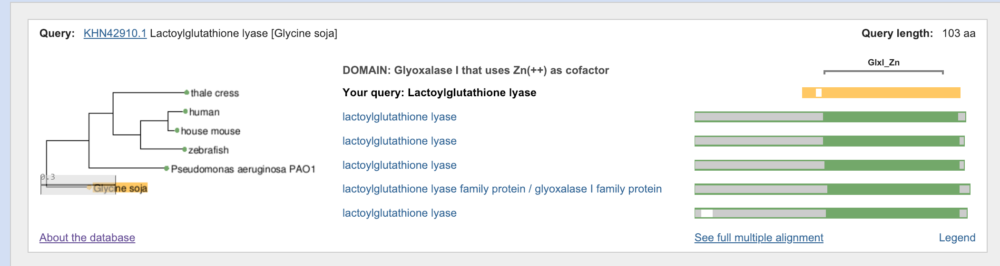

Best Blast hit to nr is lactoylglutathione lyase in [Proteobacteria].  Appears to be bacterial.

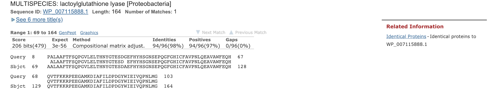

### Cluster 81606138 at 95% similarity

```
clstrOut KHN16331  95  81606138  81  0  0  0  0  0  = 1	clstrOut KHN16331  = KHN16331 Acyl carrier protein, partial  Glycine soja  ^A
clstrOut WP_007115622  95  81606138  80  1  80  2  80  10  = 1	clstrOut WP_007115622  = WP_007115622 acyl carrier protein  Moraxella osloensis  ^A EEV23423 acyl carrier protein  Enhydrobacter aerosaccus SK60  ^A KND22279 acyl carrier protein  Enhydrobacter aerosaccus  ^A AME01237 acyl carrier protein  Moraxella osloensis  ^A OBX56239 acyl carrier protein  Moraxella osloensis  ^A OBX57040 acyl carrier protein  Moraxella osloensis  ^A PAL15300 acyl carrier protein  Moraxella osloensis  ^A ATR79377 acyl carrier protein  Moraxella osloensis  ^A ATW71819 acyl carrier protein  Moraxella osloensis  ^A PKZ68913 acyl carrier protein  Moraxella osloensis  ^A STY96642 Acyl carrier protein  Moraxella osloensis  ^A
clstrOut WP_060994515  95  81606138  80  1  80  2  80  98  = 1	clstrOut WP_060994515  = WP_060994515 MULTISPECIES: acyl carrier protein  Proteobacteria  ^A BAV12443 acyl carrier protein  Moraxella osloensis  ^A ONG37806 acyl carrier protein  Enhydrobacter sp. H5  ^A ATW70540 acyl carrier protein  Moraxella osloensis  ^A ATY49241 acyl carrier protein  Moraxella osloensis  ^A
clstrOut WP_065262776  95  81606138  80  1  80  2  80  98  = 1	clstrOut WP_065262776  = WP_065262776 acyl carrier protein  Moraxella osloensis  ^A OBX64939 acyl carrier protein  Moraxella osloensis  ^A
```

Here is the sequence that is taxonomically classified in the genus Glycine
```
clstrOut KHN16331  95  81606138  81  0  0  0  0  0  = 1	clstrOut KHN16331  = KHN16331 Acyl carrier protein, partial  Glycine soja  ^A
```

SMARTBLAST of KHN16331 suggest clustering with bacteria.

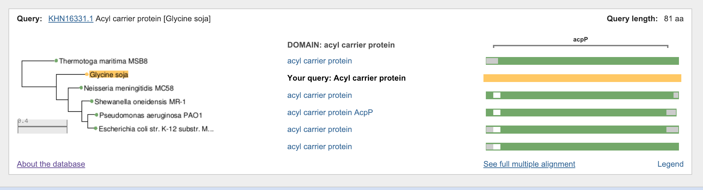

Best Blast nr hit is to acyl carrier protein in the bacteria Moraxella oslensis.
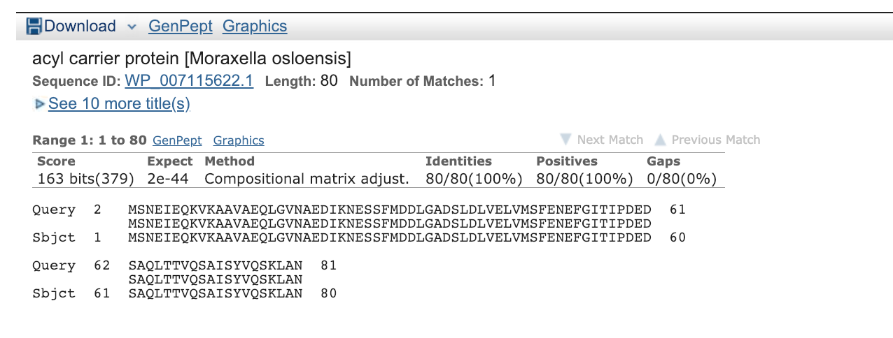


Summary
```
AAL67577 glyphosate-insensitive form  5-enolpyruvylshikimate 3-phosphate (EPSP) synthase that is used in the genetically modify crops for [Glyphosate-based herbicides resistance]

KHN16331 FAD, nodules, similar to chloroplast gene

KHN16331,KHN42910,KHN24658,KHN25027 are all part of the same BioSample: SAMN02905861.
```
